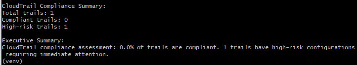
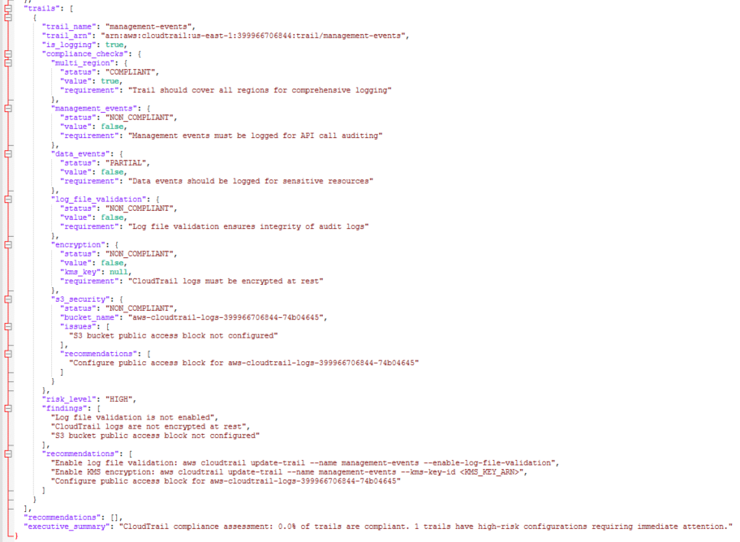
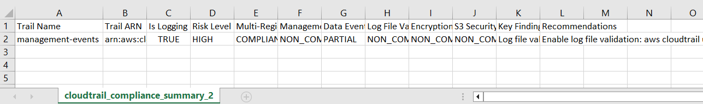

# AWS CloudTrail Compliance Validator

Python tool that validates CloudTrail logging against SOC 2 and NIST controls with automated evidence reports.

---

## Overview

This project automates the validation of AWS CloudTrail configurations to ensure proper logging, monitoring, and audit readiness.
It checks CloudTrail against key requirements from SOC 2 CC7.2 and NIST 800-53 AU controls, identifies gaps, and generates audit-ready JSON and CSV evidence reports.

This is a real-world GRC engineering project designed to demonstrate how compliance moves beyond checklists into automated, code-driven validation.

---

## Learning Objectives

By completing this project, I learned how to:
- Validate CloudTrail trails across an AWS account
- Detect compliance gaps such as missing encryption, missing management events, and improper S3 bucket settings
- Interpret CloudTrail event selectors and logging status using boto3
- Generate timestamped JSON and CSV evidence for auditors
- Map CloudTrail settings to SOC 2 and NIST 800-53 AU controls
- Use AWS SSO profiles with Python and the AWS CLI

---

## How to Run the Validator

1. Activate virtual environment
```bash
python -m venv venv
source venv/Scripts/activate   # Windows Git Bash
```
2. Log in to AWS using SSO
```bash
aws configure sso
aws sts get-caller-identity --profile profilename
```
3. Run the validator
```bash
python cloudtrail_validator.py --profile profilename
```

### Outputs generated:

This is the ouput in your CLI:



These two reports are saved in the same folder where the script is run:

- ```cloudtrail_compliance_report_20251106_094843.json```



- ```cloudtrail_compliance_summary_20251106_094843.csv```



---

## AWS CLI Commands You May Need

Enable CloudTrail log file validation:
```bash
aws cloudtrail update-trail --name management-events --enable-log-file-validation
```

Enable encryption (replace `YOUR_KMS_KEY_ARN`):
```bash
aws cloudtrail update-trail --name management-events --kms-key-id <YOUR_KMS_KEY_ARN>
```

Configure S3 public access block for CloudTrail logs:
```bash
aws s3api put-public-access-block \
  --bucket BUCKET_NAME \
  --public-access-block-configuration \
  BlockPublicAcls=true,IgnorePublicAcls=true,BlockPublicPolicy=true,RestrictPublicBuckets=true
```

---

## Code Snippets 

Selected excerpts from the CloudTrail compliance validator. These excerpts highlight key concepts used in the lab.

### 1. AWS Authentication Using boto3 + SSO 

This snippet demonstrates how the validator establishes an authenticated session using an AWS CLI/SSO profile.
It ensures that all AWS API calls are performed under the correct identity and account context.

```python
# Initialize AWS session with optional SSO/CLI profile
if profile_name:
    session = boto3.Session(profile_name=profile_name)
else:
    session = boto3.Session()

cloudtrail = session.client("cloudtrail", region_name=region_name)
s3 = session.client("s3", region_name=region_name)
sts = session.client("sts", region_name=region_name)

# Get AWS Account ID for reporting
account_id = sts.get_caller_identity()["Account"]
```

#### What I Learned

- How boto3 uses AWS CLI or SSO profiles for secure authentication
- How to initialize service clients for CloudTrail, S3, and STS
- How to retrieve the AWS account ID to include in reports
- Why identity-aware sessions are critical for logging and audit validation

### 2. Compliance Check Example: Management Events Logging

This snippet shows how a single compliance requirement (logging of management API events) is validated.
This is one of the core requirements under NIST AU-2 and SOC 2 CC7.2.

```python
# Check if management events are enabled
management_events_enabled = False

for selector in trail.get("EventSelectors", []):
    if selector.get("IncludeManagementEvents", False):
        management_events_enabled = True

result["compliance_checks"]["management_events"] = {
    "status": "COMPLIANT" if management_events_enabled else "NON_COMPLIANT",
    "value": management_events_enabled,
    "requirement": "Management events must be logged for API call auditing"
}
```

#### What I Learned

- How CloudTrail event selectors determine what is being logged
- How to detect missing management events (critical audit gap)
- How to convert AWS configuration into compliance statuses
- How mapped requirements (NIST/SOC 2) drive validation logic

### 3. Saving JSON Evidence Reports

This snippet shows how audit-ready CloudTrail findings are written to a timestamped JSON file.
These files become official evidence for SOC 2, ISO 27001, and NIST audits.

```python
# Save CloudTrail compliance report as JSON
timestamp = datetime.now().strftime("%Y%m%d_%H%M%S")
filename = f"cloudtrail_compliance_report_{timestamp}.json"

with open(filename, "w") as f:
    json.dump(report, f, indent=2)

print(f"Report saved: {filename}")
```

#### What I Learned

- How to generate structured, timestamped evidence files
- How JSON formats support auditors and automated tooling
- Why consistent naming conventions matter for audit readiness
- How compliance automation transforms manual reviews into code-driven evidence

---

### Summary of Technical Skills Demonstrated

Through these snippets, I practiced key GRC engineering skills:
- AWS authentication with secure SSO profiles
- Interpreting CloudTrail configuration programmatically
- Mapping AWS settings to compliance controls (SOC 2, NIST 800-53)
- Generating audit-ready JSON and CSV evidence
- Identifying misconfigurations in AWS logging infrastructure

---

## Evidence Sample

Example output:

```yaml
Total trails: 1  
Compliant trails: 0  
High-risk trails: 1  
```
Key findings included:
- Management events not logged
- Log file validation disabled
- CloudTrail logs not encrypted at rest
- S3 log bucket missing public access block

Risk level:
```text
HIGH
```

These findings map directly to:
- SOC 2 CC7.2
- NIST 800-53 AU-2, AU-3, AU-6, AU-12

---

## What This Project Demonstrates

This project demonstrates my ability to:

- Perform automated compliance validation in AWS
- Translate AWS settings into audit-ready evidence
- Use boto3 to inspect logging, encryption, and event selectors
- Understand CloudTrail's role in SOC 2 and NIST 800-53 audit logging
- Identify high-risk misconfigurations and remediation steps
- Work like a GRC engineer who bridges compliance + cloud automation

This is the type of compliance engineering work used in real organizations preparing for audits, building continuous monitoring, and reducing manual evidence collection.

---

✔️ This lab reinforces how GRC engineers use automation, not manual review, to validate cloud controls at scale.

---
